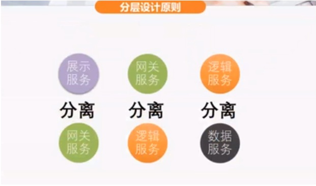

#                                                XXX系统服务化改造技术方案

### 系统现状描述

``
   我们目前的系统由于历史原因还是一个单体的巨无霸应用,包含了很多子业务系统,某一个子业务的异常可能会导致整个系统的不可用,
   为了满足后续业务的发展,我们需要对原有的系统进行分布式的服务化改造,对原来的业务进行拆分,拆分为一系列的子业务系统,从而从整体上
   确保我们系统的高可用
``

### 服务化拆分的一般原则

* 从业务维度出发进行垂直方向拆分,将一个巨无霸系统分拆为多个子系统

* 从功能维度出发进行水平方向拆分,将子系统拆分为功能不同的各个层

* 遵循单一职责原则,子系统的职责尽量单一,拥有一个明确的上下文限定

* 拆分后的每个服务粒度尽量适中不要过大或者过小

* 拆分后的服务之间避免环形依赖和双向依赖

### 拆分后的模块[子系统]划分

### 拆分后系统之间的依赖

### 系统拆分后的层次划分

```
  我们通过业务垂直拆分后,每个业务都有了自己的边界上下文,都可以进行独立开发测试和部署.  

  为了使每个业务能够更好的对外提供服务,每一个独立的业务在功能层面进一步可以进行水平拆分,拆分为物理上独立的逻辑单元. 
   
  依次可以拆分为Web Layer[Web Api层], Business Layer[业务逻辑层], Data Access Layer[数据访问层],Data Store Layer[DB,Redis].
  
  为了实现系统的异步化,以便提升系统的并发吞吐量,还可以引进MQ Service Layer[消息服务层].
  
  根据Martin Fowler的微服务架构的设计理念,我们可以将功能拆分后的各个逻辑单元作为单独的JVM进程进行部署[每个进程都是一个独立的JVM应用].
```

### 水平分层图示



### 系统拆分后各层之间的通信原则

* Web Layer对外通过HTTP/HTTPS协议进行通信

* Web Layer与Business Layer之间采用RPC协议进行通信[eg:Dubbo服务化框架]

* Business Layer与Data Access Layer之间采用RPC协议进行通信[eg:Dubbo服务化框架]

* Data Access Layer与Data Store Layer直接通过SQL97协议或者TCP协议进行通信

```
    系统功能经过水平拆分后系统之间的调用链可以分为同步调用模式以及异步调用模式[在Web Layer与Business Layer之间添加了MQ服务层],  
    具体参考下图所示
```

### 同步架构和异步架构图示


          
          系统同步架构图    


``
    系统异步架构图
``


### 系统高可用以及高扩展性的建设方案

```
为了保证系统7 * 24小时的可用,以及要达到业界4个9的标准[99.99%],也就是说全年的宕机时间接近1个小时左右,

我们的系统要做到高可用以及高可扩展性 要达到这些标准有以下原则和做法可以参考.
```

* 服务的无状态化设计

```
  A:冗余部署多个服务都是完全对等;
  
  B:请求到任何一台服务结果都一样;
  
  C:服务不存储业务上下文信息;
  
  D:有利于服务的弹性扩容和缩容
```

```
    为了实现或者满足服务的无状态化，

    我们可以对用户的Session/Token数据进行集中时存储,

    存储在redis集群中,业务系统不存储session/token数据.
```

* 服务的负载均衡设计

```

    【客户端接入层  ->  Nginx反向代理层】的负载均衡
    
            客户端接入层到Nginx反向代理层的负载均衡一般是通过DNS轮询实现的:DNS-Server对于一个域名配置了多个解析ip,
            
            每次DNS解析请求来访问DNS-server,会轮询返回这些ip,保证每个ip的解析概率是相同的.
            
            这些ip就是nginx的外网ip,以做到每台nginx的请求分配也是均衡的。
        
    【Nginx反向代理层 -> Web Layer】的负载均衡
    
        Nginx反向代理层到Web Layer的负载均衡是通过Nginx实现的.通过修改nginx.conf,可以实现多种负载均衡策略:
        
            1) 请求轮询:和DNS轮询类似,请求依次路由到各个Web Layer
        
            2) 最少连接路由:哪个Web Layer的连接少,路由到哪个Web Layer
        
            3) ip哈希:按照访问用户的ip哈希值来路由Web Layer
    
    【Web Layer  -> Business Layer】的负载均衡
    
        由于Web Layer调用Business Layer的服务是通过Dubbo服务框架进行的,Dubbo服务框架内在提供了智能化的负载均衡能力
    
    【Business Layer  -> Data Access Layer】的负载均衡
      
        由于Business Layer调用Data Access Layer的服务是通过Dubbo服务框架进行的,Dubbo服务框架内在提供了智能化的负载均衡能力
```

* 服务的幂等设计

```
    幂等的定义:用户对于同一操作发起的一次请求和多次请求的结果是一致的,不会因为多次请求而产生副作用.
    
    幂等广义上一般指以相同参数调用同一个接口多次,对系统内部产生的影响是一致的.比如说进行支付时,如果一次扣款操作因为某种原因调用了两次,那么理论上应该只生效一次,否则就会出现一定的风险.
    
    在分布式系统中,由于分布式天然特性的时序问题,以及网络的不可靠性(机器,机架,机房故障,电缆被挖断等等),重复请求很常见,接口幂等性设计就显得尤为重要.
    
    服务的幂等从理论层面上来说比较抽象,工程实践中一般分为请求层面的幂等以及业务层面的幂等.
    
    A:请求层面的幂等
        对于读请求[Read]来说,由于读请求不对数据造成修改所以读请求是天然幂等的;
        对于写请求[Create,Update,Delete]来说,由于写请求可能会对数据造成修改所以写请求要确保幂等
    
    B:业务层面的幂等
        由于分布式系统中对原来的单体应用进行了业务层面的拆分,某些业务操作原来只需要local tranction即可,
        但是在分布式系统中这些业务进行了拆分分为了多个数据库,所以这些业务要求业务层面的幂等,最终需要分布式锁来
        确保业务操作的幂等.
```

* 服务的熔断限流设计


### 系统微服务化架构设计的一些思考

* 微服务架构的本质
    ```
        A:两个维度拆分
            A1:按照业务维度进行垂直拆分 
            A2:按照功能维度进行水平拆分 
            
        B:业务架构:微服务在本质上是一个业务架构
         
        C:组织架构:根据康威定理来说微服务架构是组织架构的体现
    ```
    
* 微服务架构的适用场景

    ```
        A:系统需求层面
            适合系统需求变化频率比较高的业务场景,例如电商,供应链等业务
                
        B:系统性能层面
            适合系统吞吐量高,系统响应时延不高的业务
        
        C:系统数据一致性层面
            比较适合系统数据弱一致性【最终一致性的场景】
    ```
    
* 微服务架构的目的

    ```
        A:提高项目开发团队的开发效率,使项目能够快速部署
        
        B:促进产品的持续迭代,快速响应市场变革
    ```
    
* 微服务架构时代的多语言共存


### 参考文档

* 
*
*


